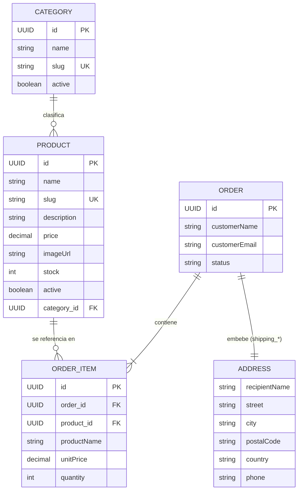

# Plan de backend CandyCorn

## Arquitectura

El backend será una API REST independiente del frontend, organizada por módulos y capas:

```text
controller -> service -> repository -> entity
```

Estructura propuesta:

```text
com.candycorn.shop
├── common
│   ├── exception
│   ├── response
│   └── validation
├── catalog
│   ├── controller
│   ├── dto
│   ├── entity
│   ├── mapper
│   ├── repository
│   └── service
├── order
├── user
└── ShopApplication.java
```

## Orden de implementación

1. Catálogo: categorías, productos, stock y consultas públicas.
2. Pedidos: pedidos, líneas, direcciones y estados.
3. Administración local: gestión de catálogo y pedidos sin autenticación.
4. Pagos: proveedor, webhooks y estados de pago.
5. Calidad: OpenAPI, tests de integración, observabilidad y documentación.

Durante esta fase educativa y de ejecución local no se incluirán Spring Security,
autenticación ni autorización. Los endpoints administrativos, cuando se creen,
se mantendrán separados bajo `/api/v1/admin` y se considerarán accesibles solo
desde el entorno local. La seguridad podrá añadirse posteriormente en una rama
independiente.

## Catálogo

Modelos iniciales:

- `Category`: `id`, `name`, `slug`, `active`, `createdAt`, `updatedAt`.
- `Product`: `id`, `name`, `slug`, `description`, `price`, `imageUrl`, `stock`, `active`, `category`, `createdAt`, `updatedAt`.

Reglas:

- Los precios usan `BigDecimal`.
- Los identificadores usan UUID.
- El stock no puede ser negativo.
- Los slugs son únicos.
- Los productos se desactivan en vez de borrarse físicamente.
- Las entidades no se exponen directamente en la API; se usarán DTOs.

Endpoints públicos previstos:

```text
GET /api/v1/products
GET /api/v1/products/{id}
GET /api/v1/products/slug/{slug}
GET /api/v1/categories
GET /api/v1/categories/{id}/products
```

## Base de datos

Flyway versionará todos los cambios de esquema. Hibernate usará `ddl-auto=validate` en producción. Las pruebas usarán H2 y, posteriormente, Testcontainers con PostgreSQL.

## Pedidos

Los precios se copiarán en cada `OrderItem` al crear el pedido. La creación será transaccional y reservará stock dentro de la misma operación.

Estados previstos:

```text
PENDING, CONFIRMED, PREPARING, SHIPPED, DELIVERED, CANCELLED
```

## Esquema de relaciones

Refleja las entidades implementadas hasta ahora (Catálogo y el modelo de Pedidos). `Address` no es una tabla propia: es un `@Embeddable` que se guarda como columnas `shipping_*` dentro de `orders`. `User` aparece en la estructura de paquetes del plan pero todavía no tiene entidad ni tabla.



Notas:

- `Product` no se borra físicamente al desactivarse, así que `ORDER_ITEM.product_id` sigue siendo válido aunque el producto ya no esté activo; por eso `OrderItem` guarda `productName`/`unitPrice` como copia (snapshot) en el momento del pedido, en vez de depender de los valores actuales del producto.
- `Order` es la raíz del agregado: `OrderItem` solo se crea y se modifica a través de `Order.addItem(...)`, no tiene repositorio propio.

## Calidad

Cada funcionalidad tendrá tests unitarios, de repositorio y de API. Los errores se devolverán mediante un formato común usando `@RestControllerAdvice`. La API se versionará bajo `/api/v1` y se documentará con OpenAPI.

## Progreso

### 2026-08-21

- `Product.changeStock` rechaza valores negativos, aplicando en código la regla de "el stock no puede ser negativo" ya recogida en este plan.
- La validación de paginación (`page`/`size`) se extrae a `validatePagination` en `ProductService` y se reutiliza también en la búsqueda de productos por categoría, que antes no la aplicaba.
- `ProductSpecifications.nameContains` usa `Locale.ROOT` al pasar a minúsculas para evitar comportamientos distintos según el locale del servidor.
- `GlobalExceptionHandler` añade dos manejadores: `MethodArgumentTypeMismatchException` (parámetros con tipo inválido, p. ej. un UUID o precio mal formado) devuelve 400, y un manejador genérico de `Exception` devuelve 500 y registra el error en vez de dejarlo sin capturar.
- Se añaden tests unitarios y de controlador cubriendo estos casos: stock negativo, paginación inválida al listar por categoría, y parámetros de tipo inválido en los endpoints de productos.

### 2026-08-22

Arranca el paso 2 del plan (Pedidos), con modelos y repositorio (todavía sin endpoints ni lógica de creación transaccional):

- Nuevas entidades en `com.candycorn.shop.order.entity`: `Order` (raíz del agregado), `OrderItem`, `Address` (embeddable) y el enum `OrderStatus`.
- `Order.addItem(product, quantity)` copia nombre y precio del producto como snapshot en cada `OrderItem`, tal y como recoge este plan; rechaza cantidades no positivas.
- `Order.changeStatus(...)` valida las transiciones de estado permitidas (`PENDING → CONFIRMED/CANCELLED`, etc.) y rechaza saltos inválidos o transiciones desde estados terminales (`DELIVERED`, `CANCELLED`).
- `OrderRepository` (`com.candycorn.shop.order.repository`) como único repositorio del agregado; no hay repositorio propio para `OrderItem` porque se accede siempre a través de `Order`.
- Migración `V3__create_order_tables.sql` con las tablas `orders` y `order_items`, incluyendo el check de estado válido y las claves foráneas hacia `products`.
- Tests unitarios de la entidad `Order` cubriendo snapshot de precios, cálculo del total, y transiciones de estado válidas/inválidas.

Pendiente para continuar Pedidos: DTOs, `OrderService` con la creación transaccional (copiar precios y reservar stock en la misma operación, según recoge este plan) y los endpoints correspondientes.
